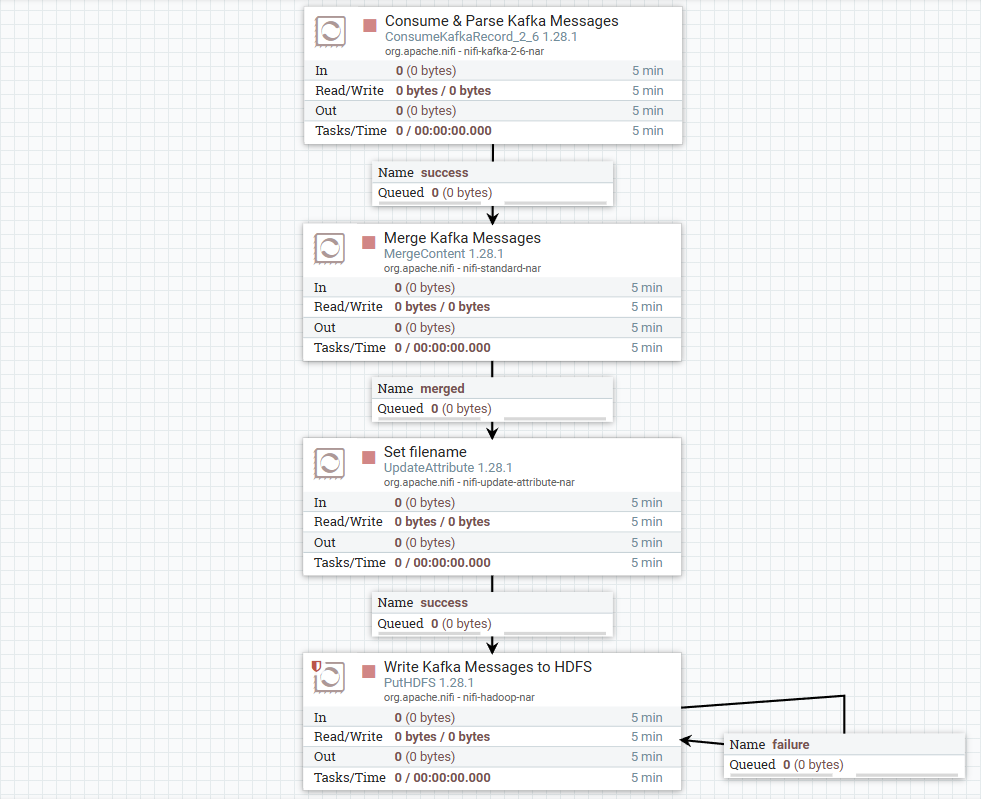
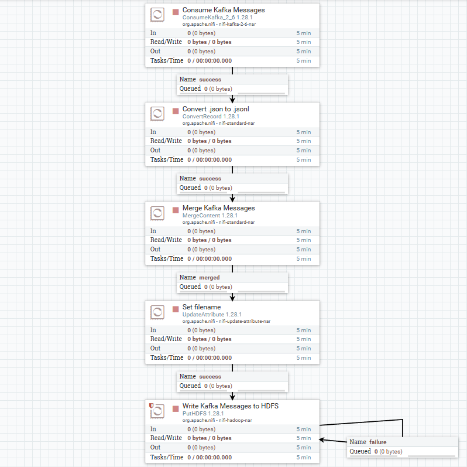
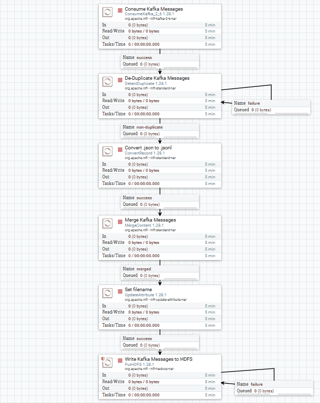
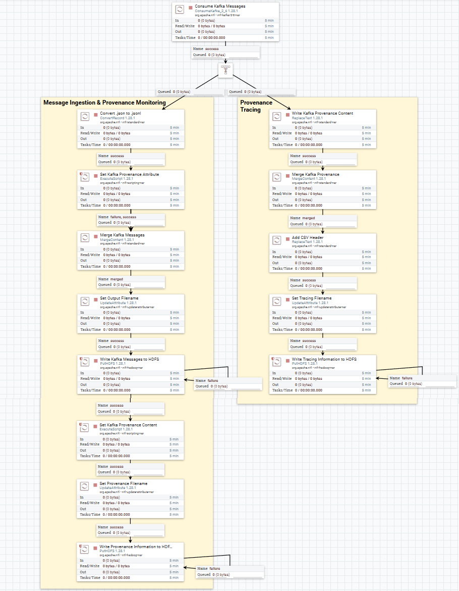
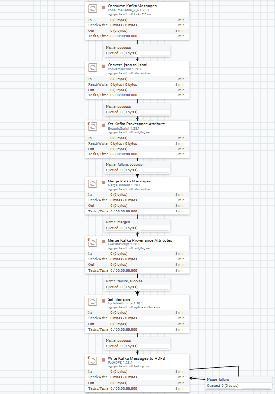
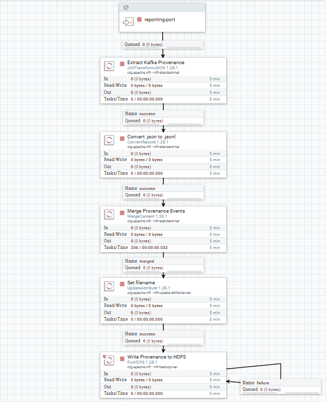

# Introduction

This exploratory project discusses the implementation of data ingestion flows, from Kafka to HDFS, using NiFi. A few monitoring systems are also proposed. The ingestion of JSON files is used as an example.

Is assumed that no data is lost due to disk corruption on the NiFi machines. Such assumption can hold when the disk is replicated, [which is natively offered by Amazon EBS](https://docs.aws.amazon.com/ebs/latest/userguide/EBSFeatures.html) for example. Note that [the Cloudera Data Flow service itself leverages EBS](https://community.cloudera.com/t5/Community-Articles/Cloudera-DataFlow-CDF-Questions-amp-Answers/ta-p/300169).

# Propositions

## Straightforward implementation

A simple, naive implementation of such JSON data ingestion flow first bulk-consumes messages from Kafka. In order not to take up too much unnecessary space and memory for the HDFS NameNode, the JSON files are converted to JSONL upon consumption, and then merged by concatenation. Finally, the resulting files are written to HDFS, with a filename that can be based on the current time.



## A more robust solution

It appears that consuming and parsing the Kafka messages in a single step (with the `ConsumeKafkaRecord` processor) causes all the messages to be rejected when one of them is malformed. A solution for keeping the valid messages while filtering the invalid ones would be to split this process into two steps: first the raw message consumption, and the conversion to JSONL format. For this purpose, one should set the `Separate By Key` parameter to `true` for the `ConsumeKafka` processor, so that each FlowFile corresponds to a single message.



Additionally, one wants to set a truly unique filename for each FlowFile, as two messages can be processed within a second. Therefore, if we use solely the current time, then the therefore conflict. The FlowFile's `${UUID()}` is a strong candidate.

Finally, one should make sure that the write to HDFS is idempotent. Indeed, it may succeed on HDFS's side, but the acknowledgement is not atomic, therefore it may not be processed by NiFi before a cluster restart occurs, causing the write to happen once more. A solution is to use `ignore` as a `Conflict Resolution Strategy`, as a conflict implies that the file was written already. Using `Write and rename` as a `Writing Strategy` ensures that the file is only placed at the correct position once it is fully written, thus preventing partial writes in case of failure.

## Trading at-least-once for at-most-once

The NiFi consumer's offsets are typically persisted inside Kafka, by periodical asynchronous commits performed by the `ConsumeKafka` processor. Thus, the current offset can be reset to a former position, in case of cluster restart for example, if the latest offsets were not yet committed. This results in a same message being ingested multiple times. This behavior is emulated in the provided NiFi template by setting `Commit Offsets` to `false`.

Because the messages are then merged, post-deletion of duplicated messages is not easy. An alternative would be to de-duplicate the FlowFiles that have a same topic/partition/offset combination (which I will refer to as *Kafka provenance*). This can be achieved using the `DetectDuplicate` processor, that can typically leverage a persisted key-value store managed by one of the machines of the NiFi cluster.



However, communication with this store works over the network, meaning that it is once again not atomic, and a Kafka provenance key can be acknowledged and inserted in the cache, but the information may not reach the originating machine before the cluster is restarted. Upon restart, the Kafka provenance key is found in the cache, resulting in the message being filtered away, even though it was not even duplicated in the first place.

Thus, this filter effectively trades potential duplications for potential data loss. Whether this is preferable depends on the use case. When considering the replication of a source database via delta loads where only the latest version of each row is kept, duplication causes no issue. On the other hand, when performing full loads of a table, both data duplication and data loss are in fact problematic, but replaying the ingestion of missing messages may be easier. NiFi's `KafkaConsumer` does not allow for consuming only a given set of offsets, though.

## Embedded monitoring within the ingestion flow

It becomes quite important to implement some kind of Kafka provenance monitoring for the messages flowing through NiFi, in order to identify malformed messages that could not be ingested, as well as potential message duplications or losses.

An idea could be to trace the Kafka provenance of all incoming messages, as well as the aggregated provenance of the outgoing files. Assuming some synchronization between the two, the difference would reveal the messages that were lost during the process. Additionally, duplicated messages result in duplicated entries in this monitoring data, and can therefore be detected as well.

As the `MergeContent` processor does not support merging attributes though, one needs a few tricks to trace all the messages that constitute a merged file. I first implemented [a custom Groovy script](/nifi/scripts/set_kafka_provenance_attribute.groovy) that sets a first unique attribute key containing the topic, the partition and the offset of the message. All these keys are then preserved using the `Keep All Unique Attributes` `Attribute Strategy`, then can be retrieved via [a second Groovy script](/nifi/scripts/set_kafka_provenance_content.groovy).



As an alternative, when filtering duplicates using a `DistributedMapCacheServer`, one can retrieve the ingoing Kafka provenance by fetching all the keys, by communicating with the server via a raw socket, as demonstrated in [this script](/CacheServerMonitoring.scala). However, it may be unsuitable for a production usage, as it is undocumented, and I don't know whether user authentication is even supported.

## Monitoring with a ReportingTask

It appears that such embedded monitoring ends up bloating the data ingestion flow with many additional processors, which could degrade the performance of the data ingestion system. An alternative could be to track the Kafka offsets through the system via the NiFi provenance events, using the `SiteToSiteProvenanceReportingTask`. This reporting task publishes NiFi provenance events, [carrying notably FlowFile attributes](https://nifi.apache.org/docs/nifi-docs/components/org.apache.nifi/nifi-site-to-site-reporting-nar/stable/org.apache.nifi.reporting.SiteToSiteProvenanceReportingTask/additionalDetails.html), to another NiFi flow.

This solution still implies using [these](/nifi/scripts/set_kafka_provenance_attribute.groovy) [two](/nifi/scripts/merge_kafka_provenance_attributes.groovy) custom `ExecuteScript` processors in the ingestion flow, in order to keep track of all Kafka offsets as FlowFile attributes.

With this setup, ingoing Kafka messages can be traced by retrieving the attributes of the FlowFiles that are `RECEIVE`d by the `ConsumeKafka` processor. Outgoing Kafka provenance is found in the attributes of the FlowFiles that the `PutHDFS` processor `SEND`s.





This site-to-site communication protocol operates over the network. One should favor the HTTP transport protocol over a `RAW` socket, as HTTP leverages TCP and therefore [guarantees the reliability of the data transmission](https://en.wikipedia.org/wiki/Transmission_Control_Protocol#Data_transfer).

However, the communication is not atomic (nor idempotent). [The ReportingTask's event consumer updates its state after the events are transmitted](https://github.com/apache/nifi/blob/6f958fe068d67e96f93830d3244c57dda753f9d2/nifi-extension-bundles/nifi-extension-utils/nifi-reporting-utils/src/main/java/org/apache/nifi/reporting/util/provenance/ProvenanceEventConsumer.java#L217-222), therefore they may be duplicated if the cluster restarts. This is fine if we use the at-most-once strategy, where we only need to detect lost messages, but it is unreliable for detecting duplications when using the at-least-once strategy.

# Takeaways

We went through quite a hassle, trying to design a robust data ingestion solution with NiFi. Even though durability via disk replication was assumed, NiFi only provides atomicity mechanisms for inner operations, but not for interacting with other systems, like Kafka notably. Thus, non-idempotent operations against external systems are a source of anomalies, in case of cluster restarts or node failures.

While it would theoretically be possible to implement an exactly-once Kafka consumer, by persisting the Kafka provenance atomically with the contents of the messages, NiFi does not appear to be designed accordingly, and it does not seem to be of great interest for the NiFi development team [[ref]](https://lists.apache.org/thread/n21dnfzw517kgkt0ws8mw5hqtm1ydloz). Thus, one shall choose between at-least-once and at-most-once ingestions.

Finally, we discussed a few monitoring systems for anomaly detection, based on the Kafka provenance of the ingested messages. Embedding a monitoring system within the ingestion flow guarantees reliability, however it adds much bloat and may degrade the performance. As an alternative, one can host and share a monitoring process group on another NiFi instance, but then the monitoring system itself would also be exposed to potential data duplication.

In the end, one is never better served than by oneself. If one *really* wants a reliable data ingestion system, developing it from scratch would probably be a better option.

# Running the experiments

## Prerequisites

Use Linux (or WSL), and install [Docker](https://docs.docker.com/engine/install/) with the [Docker Compose plugin](https://docs.docker.com/compose/install/linux/).

## Startup & Teardown

Run `docker compose up --build -d` to build and start local Kafka, NiFi and HDFS instances, as well as user interfaces. Note that one needs to wait a few minutes before the services are actually ready and operational.

If you don't have enough RAM to run all of these simultaneously, you can run only the services you need, by listing them in the command, e.g. `docker compose up --build -d kafka nifi hdfs`.

Run `docker compose down` when you are done, in order to tear these services down.

## Kafka

A user interface for Kafka is started and available at http://localhost:9999/.

By default, the `input-topic` topic is populated with a few messages. You can create new ones manually by opening a shell in the Kafka container using `docker compose exec -it kafka sh`, and then run producer commands like the following:

```sh
kafka-console-producer \
    --bootstrap-server "kafka:29092" \
    --topic "your-topic" \
    --property "parse.key=true" \
    --property "key.separator=:" \
    <<< "your-key:your-value"
```

## NiFi

One NiFi instance is launched, and can be accessed at https://localhost:8080/nifi/.

One can then import the [nifi/template.xml](/nifi/template.xml) template in NiFi in order to spawn all process groups.

Unfortunately, the `SiteToSiteProvenanceReportingTask` is not preserved by the template. One may add it manually, based on [the provided configuration](/nifi/reporting-task.json).

## HDFS

The Hue UI for HDFS is available at http://localhost:8888/. You will be prompted an username and password; you can use whatever you want.

Alternatively, you can run DFS commands through the HDFS container, after opening a shell using `docker compose exec -it hdfs sh`. [Here](https://hadoop.apache.org/docs/stable/hadoop-project-dist/hadoop-common/FileSystemShell.html) is the reference. For example, you can list all the files stored in HDFS using `hdfs dfs -ls -R hdfs://hdfs:9000/`

## Monitoring script

[A Scala script](/CacheServerMonitoring.scala) is available for listing the Kafka provenance of the ingested messages, by communicating with the NiFi `DistributedMapCacheServer`. It can be run using Docker:

```sh
docker run --rm -it --volume "$PWD":/app --network kafka-nifi-monitoring_default sbtscala/scala-sbt:eclipse-temurin-alpine-21.0.5_11_1.10.7_3.6.3 scala /app/CacheServerMonitoring.scala
```
